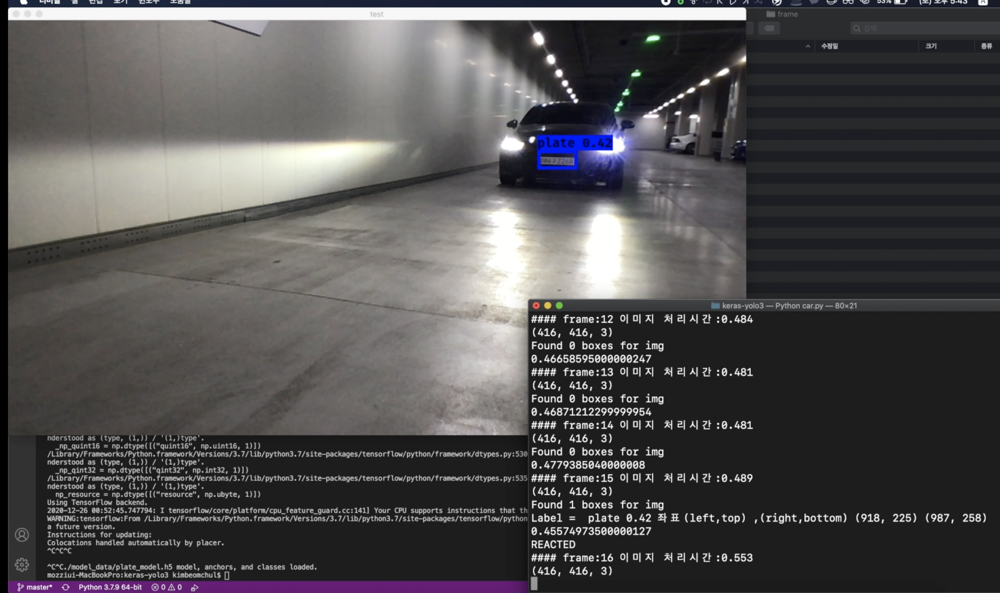
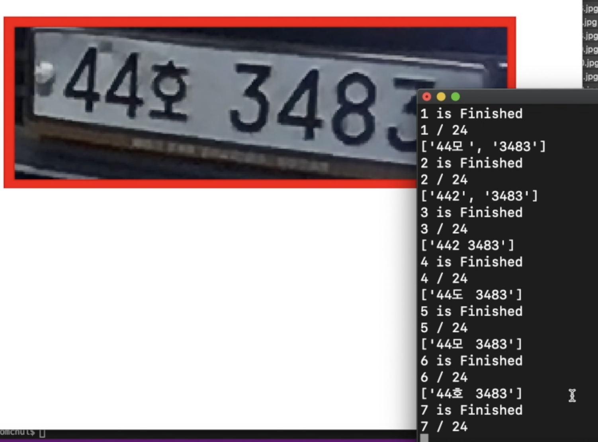

## 2021 신기술프로젝트 ( 번호판 탐지 및 OCR ) 
- 제작 기간 : Nov 2020 ~ Jan 2021
- 맡은파트 : 번호판 탐지 && OCR
- 초기목적 : SRGAN을 이용한 흐린 번호판 화질개선 프로젝트였지만 유의미한 화질개선이 
발생하지 않아 OCR로 변경
1. 번호판 인식을 위한 라벨링작업
2. 번호판 인식 모델 학습
3. 번호판 인식범위로 이미지 자르기
4. 잘라진 이미지에 대한 숫자 라벨링작업
5. 완료된 라벨링 작업에 대한 OCR모델생성
-  4&5번 에서 발생하는 낮은 인식률로인해 오픈소스를 이용한 OCR진행

## Demo
- img 폴더내 mp4 파일 존재 
- 데모 라쿤인식

- 차량 번호판인식

- 차량 OCR

## What We Used

### Training Image Data < 라쿤 & 러시아번호판 >
- 참고 
https://www.kaggle.com/andrewmvd/car-plate-detection 
https://www.kaggle.com/aritrag/license
https://www.kaggle.com/pcmill/license-plates-on-vehicles
https://www.kaggle.com/scholngusmaximus/numberplate-bounding-box-india-eu-brazil-us?select=Indian_eu_br_us_plates_compressed
https://www.kaggle.com/ankitbarai507/indian-vehicle-license-plates
https://www.kaggle.com/mrugankray/license-plates
https://www.kaggle.com/ckay16/indian-number-plate-detection
https://www.kaggle.com/xairete/car-plates-ocr
Kaggle ▷ Datasets ▷ Search 'car plate'	https://www.kaggle.com/search?q=car+plate+in%3Adatasets
